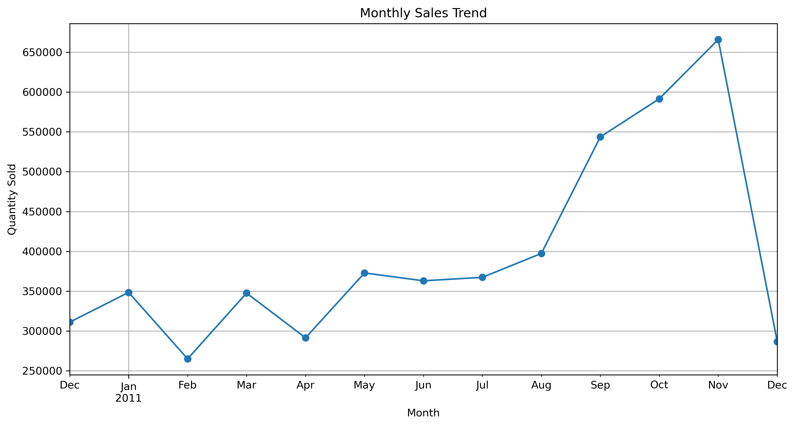

# 📊 E-Commerce Sales Analysis

[](https://www.python.org/)
[](LICENSE)
[](https://www.kaggle.com/datasets/ertugrulesol/online-retail-data)

This repository contains a comprehensive **exploratory data analysis (EDA)** of an e-commerce transactions dataset using Python and Jupyter Notebook.  

The goal is to uncover insights about **customer purchasing behavior, product performance, and sales trends across countries**, providing actionable information for business strategy and decision-making.

---

## 📑 Table of Contents
- [Project Structure](#-project-structure)  
- [Data Source](#-data-source)  
- [Key Insights & Business Recommendations](#-key-insights--business-recommendations)  
- [Example Visualizations](#-example-visualizations)  
- [Tools & Libraries](#-tools--libraries)  
- [Setup & Reproducibility](#-setup--reproducibility)  
- [Best Practices](#-best-practices-implemented)  
- [Future Work](#-future-work)  
- [Author](#-author)  
- [License](#-license)  

---

## 🗂️ Project Structure
```
ecommerce-sales-analysis/
 ┣ assets/
 ┃ ┣ top_products.png
 ┃ ┣ top_countries.png
 ┃ ┗ monthly_sales.png
 ┣ notebooks/
 ┃ ┗ ecommerce_analysis.ipynb
 ┣ README.md
 ┣ requirements.txt
 ┗ .gitignore
```

---

## 📂 Data Source
The dataset used in this analysis is the **[Online Retail Data](https://www.kaggle.com/datasets/ertugrulesol/online-retail-data)** from Kaggle.  

> ⚠️ Due to licensing and size restrictions, the full raw dataset is **not included** in this repository.  

To reproduce the analysis:  
1. Download the dataset from Kaggle.  
2. Place the CSV file inside the `data/` directory.  
3. The notebook will automatically load data from `data/online_retail.csv`.  

---

## 🚀 Key Insights & Business Recommendations  

1. **Product Portfolio**  
   - A small group of products contributes disproportionately to overall sales.  
   - *Recommendation*: Prioritize these high-performing products in **inventory planning and promotions** to maximize return on investment.  

2. **Market Concentration**  
   - The **United Kingdom dominates** sales volume, while international markets (Germany, France, Netherlands, Australia) remain relatively small.  
   - *Recommendation*: Maintain UK market leadership while developing **localized campaigns** to expand international sales.  

3. **Seasonality**  
   - Sales consistently peak in **November–December**, reflecting strong **holiday-driven demand**.  
   - *Recommendation*: Increase stock levels and launch **targeted Q4 marketing campaigns** to capture seasonal opportunities.  

4. **Customer Engagement (Expansion Opportunity)**  
   - Patterns suggest opportunities to explore **repeat purchases and customer segmentation**.  
   - *Recommendation*: Conduct deeper analysis of **customer lifetime value (CLV)** and design **loyalty programs** to improve long-term retention.  

---

## 📊 Example Visualizations  

### 1. Top 10 Best-Selling Products  
  
📌 *Observation*: A small number of products dominate sales, such as **Paper Craft, Little Birdie** and **Medium Ceramic Top Storage Jar**.  

---
### 2. Top 10 Countries by Sales Quantity  
  
📌 *Observation*: The **United Kingdom contributes the majority of transactions**, while other countries like Germany, France, and the Netherlands play a smaller role.  

---
### 3. Monthly Sales Trend  
  
📌 *Observation*: Clear **seasonal sales patterns** exist, with demand peaking in **November–December** (holiday shopping).  

---

## 🛠️ Tools & Libraries
- **Python**: Programming language for analysis  
- **Pandas / NumPy**: Data cleaning, transformation, aggregation  
- **Matplotlib / Seaborn**: Visualization and styling  
- **Jupyter Notebook / Lab**: Interactive analysis environment  
- *(Optional: Plotly for interactive charts, Scikit-learn for clustering/segmentation)*

---

## ⚙️ Setup & Reproducibility

### 1. Clone the repository
```bash
git clone https://github.com/<your-username>/ecommerce-sales-analysis.git
cd ecommerce-sales-analysis

```
### 2. Create a virtual environment
```bash
python -m venv venv
```
Activate the virtual environment:
```bash
# Linux/Mac
source venv/bin/activate

# Windows
venv\Scripts\activate
```
### 3. Install dependencies
```bash
pip install -r requirements.txt
```
### 4. Add dataset
Download the dataset from Kaggle and place it in the data/ folder:
`data/online_retail.csv`

### 5. Run the notebook
```bash
jupyter lab
```
Open notebooks/ecommerce_analysis.ipynb and run all cells to reproduce the analysis.

## 📌 Best Practices Implemented
- Modular project structure (notebooks/, data/, requirements.txt)
- Comprehensive documentation with clear purpose, actionable insights, and reproducibility
- Professional formatting with emoji headers, badges, and collapsible sections
- Encourages scalability for future analysis notebooks or scripts

## 🔮 Future Work (Planned Enhancements)
This project can be extended with the following analyses:  

- [ ] **Customer Segmentation (K-Means, RFM)**  
   Group customers based on purchasing behavior to enable personalized marketing strategies.  

- [ ] **Predictive Modeling (Time Series)**  
   Forecast future sales trends and seasonality to support demand planning.  

- [ ] **Churn Analysis**  
   Identify customers at risk of not returning and design retention strategies.  

- [ ] **Recommendation Systems**  
   Build cross-sell and up-sell models to improve average order value and customer experience.  

## 🖋️ Author
**Arditya Apusing**  
- Data Analyst | Statistics Enthusiast  
- 📧 Email: [ardityasulistya6@gmail.com](mailto:ardityasulistya6@gmail.com)  
- 🔗 LinkedIn: [linkedin.com/in/ardityaapusing](https://www.linkedin.com/in/ardityaapusing/)  
- 💻 GitHub: [github.com/ardityaapusing](https://github.com/ardityaapusing)  

## 📄 License
This project is licensed under the [MIT License](LICENSE).
